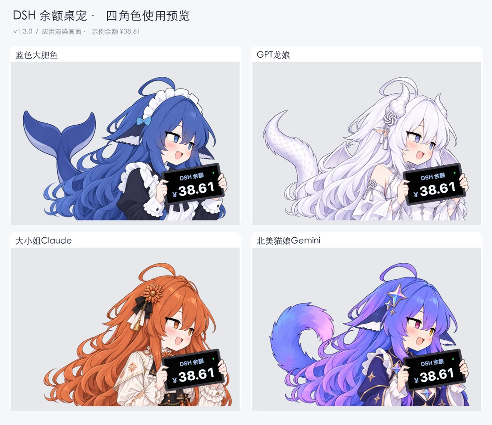

# DSH大肥鱼桌宠

一个用于 **DeepSeek Harness** 的 macOS 原生余额桌宠。角色手持平板显示余额，扣费时播放受击动画与原版音效，充值时显示提示。使用 Swift + AppKit 开发，无第三方运行时依赖。

**当前版本 v1.3.1**：支持蓝色大肥鱼、GPT龙娘、大小姐Claude、北美猫娘Gemini四个角色；蓝色大肥鱼未连接时显示抱盆图，隐藏余额文字。

## 四个角色

以下为应用实际渲染的四角色拼图，使用统一示例余额，不包含真实账号信息。

[](dsh-balance-pet-macos/docs/screenshots/four-characters-usage.png)

<table>
  <tr><th width="50%">蓝色大肥鱼</th><th width="50%">GPT龙娘</th></tr>
  <tr>
    <td align="center" width="50%"><a href="dsh-balance-pet-macos/Resources/sprite.png"></a></td>
    <td align="center" width="50%"><a href="dsh-balance-pet-macos/Resources/sprite-gpt.png"></a></td>
  </tr>
  <tr><th width="50%">大小姐Claude</th><th width="50%">北美猫娘Gemini</th></tr>
  <tr>
    <td align="center" width="50%"><a href="dsh-balance-pet-macos/Resources/sprite-claude.png"></a></td>
    <td align="center" width="50%"><a href="dsh-balance-pet-macos/Resources/sprite-gemini.png"></a></td>
  </tr>
</table>

四张原始透明 PNG 均包含在 [`Resources`](dsh-balance-pet-macos/Resources) 文件夹中；上表图片可点击查看原图。

**切换方法：** 右键桌宠，或点击菜单栏 **¥ → 切换角色**。选择立即生效，重启后自动恢复；切换保留余额、动画、窗口位置和尺寸。

蓝色大肥鱼在未配置 API Key / 账号凭证、连接中或连接失败时，改为显示抱盆图，不显示余额标题、金额、状态点或金额飘字；连接成功后自动恢复手持平板和余额显示。其他三个角色保持原有显示方式。

[](dsh-balance-pet-macos/docs/screenshots/deepseek-offline.png)

## 更新记录

### ESP32 分支 · 独立小屏原型（未发布）

- 新增面向标准版 LILYGO T-Display-S3 的独立小屏固件。配置 Wi-Fi 与凭证后，设备可自行查询余额，并用两枚实体键切换四个角色或手动刷新。
- 将角色原图另行缩小并压缩为屏幕专用 JPEG；屏幕上仅在角色手持平板内显示金额数字，长金额会滚动。原始 PNG 保持不变。
- 根据开发板实机画面反馈，轻微提亮屏幕专用 JPEG 的暗部，使角色在小屏上更清楚。
- 新增不联网的示例数字演示，便于在不录入账号凭证时检查平板内的数字位置。
- 提供[四角色模拟预览](esp32-t-display-s3/docs/four-characters-demo.png)与[刷机和配置说明](esp32-t-display-s3/README.md)。固件已编译并刷入 ESP32-S3，串口命令通过；屏幕及真实余额仍待实机确认。macOS 当前发布版本仍为 v1.3.1。

### v1.3.1 · 离线抱盆状态

- 蓝色大肥鱼在未配置 API Key / 账号凭证、连接中或连接失败时，使用上方抱盆图。
- 隐藏余额标题、金额、状态点及金额飘字；连接成功后自动恢复平板图和余额。
- 透明点击区域随图片切换，其他三个角色不变。
- README 使用轻量预览图与固定尺寸的双列表格，点击图片仍可查看完整 PNG。

### v1.3.0 · 四角色切换

- 新增 GPT龙娘、大小姐Claude、北美猫娘Gemini，与蓝色大肥鱼共四个角色。
- 通过桌宠右键菜单或菜单栏即时切换，重启后保留选择。
- 切换保留余额、动画、位置及尺寸；加入四角色使用截图和透明原图展示。

## 下载与运行

前往 [最新 Release](https://github.com/Andromedahk/DSH-DaFeiYu-Desktop-Pet/releases/latest)，下载 `DSH-DaFeiYu-macOS.zip`，解压后将 **DSH大肥鱼桌宠.app** 放入“应用程序”并打开。

- 支持 **macOS 13 及以上**；发布包同时包含 Apple Silicon 与 Intel 架构。
- 应用可读取本机 DeepSeek Harness 凭证，独立运行，无需持续打开 DSH；具体配置见 [macOS 使用说明](dsh-balance-pet-macos/README.md#凭证与余额)。
- 应用使用本地临时签名，尚未经过 Apple 开发者签名和公证。首次打开可能被系统拦截；确认下载来源后，可在“系统设置 → 隐私与安全性”中允许打开。

## 日常操作

| 操作 | 功能 |
| --- | --- |
| 左键拖动 | 移动桌宠；默认松手吸附当前屏幕左下角，可在菜单关闭 |
| 右键 / Control + 单击 | 打开菜单，切换角色、尺寸及音效等 |
| 菜单栏 ¥ | 查看余额状态、刷新余额或打开操作菜单 |
| 测试一次扣费 / 演示连续扣费 | 本地演示动画，不发起真实扣费 |

角色透明区域支持鼠标穿透，余额文字随手持平板倾斜和震动，长金额自动缩小显示。

## 从源码构建

安装 Xcode Command Line Tools 后运行：

```sh
cd dsh-balance-pet-macos
ARCH=universal ./build.sh
./verify.sh
open "dist/DSH大肥鱼桌宠.app"
```

省略 `ARCH=universal` 时只构建当前机器架构。离线验证使用独立临时配置，检查四角色资源、切换绘制、配置恢复、余额逻辑、签名和启动行为。

## 文档与来源

- [macOS 版源码与完整使用说明](dsh-balance-pet-macos/README.md)
- [代码审查与验证记录](dsh-balance-pet-macos/docs/REVIEW.md)
- [角色素材来源与文件哈希](dsh-balance-pet-macos/Resources/README.md)
- [Windows 原版存档](原版（Windows版）/DSH余额桌宠/先看这里（快速开始）.md)

本项目基于 [VKmich16/V](https://github.com/VKmich16/V) 的 Windows 原版移植，感谢原作者。原版代码和素材完整保留在 `原版（Windows版）` 目录；缓存、编译产物及个人凭证不纳入版本控制。

上游暂未附带许可证；本仓库保留来源说明，不对上游代码和素材另行授予许可。
