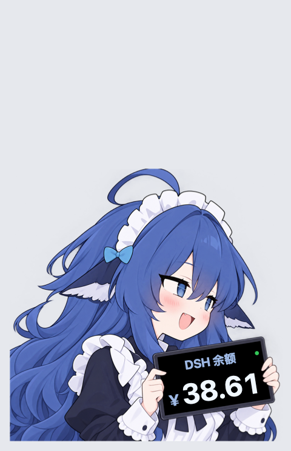

# DSH大肥鱼桌宠

用于 DeepSeek Harness 的 macOS 原生余额桌宠，基于 [VKmich16/V](https://github.com/VKmich16/V) 的 Windows 原版移植。默认使用原版蓝色大肥鱼图片和打击音效。



- [macOS 版源码与使用说明](dsh-balance-pet-macos/README.md)
- [代码审查与验证记录](dsh-balance-pet-macos/docs/REVIEW.md)
- [Windows 原版存档](原版（Windows版）/DSH余额桌宠/先看这里（快速开始）.md)

当前维护版本仅支持 macOS 13 及以上，使用 Swift + AppKit，无第三方运行时依赖。它作为独立桌面程序运行，可读取 DeepSeek Harness 的凭证来显示余额。

```sh
cd dsh-balance-pet-macos
./build.sh
open "dist/DSH大肥鱼桌宠.app"
```

原版代码与素材保留在 `原版（Windows版）` 目录；缓存、编译产物及个人凭证不纳入版本控制。

感谢原作者 VKmich16。上游暂未附带许可证；本仓库保留来源说明，不对上游代码和素材另行授予许可。
