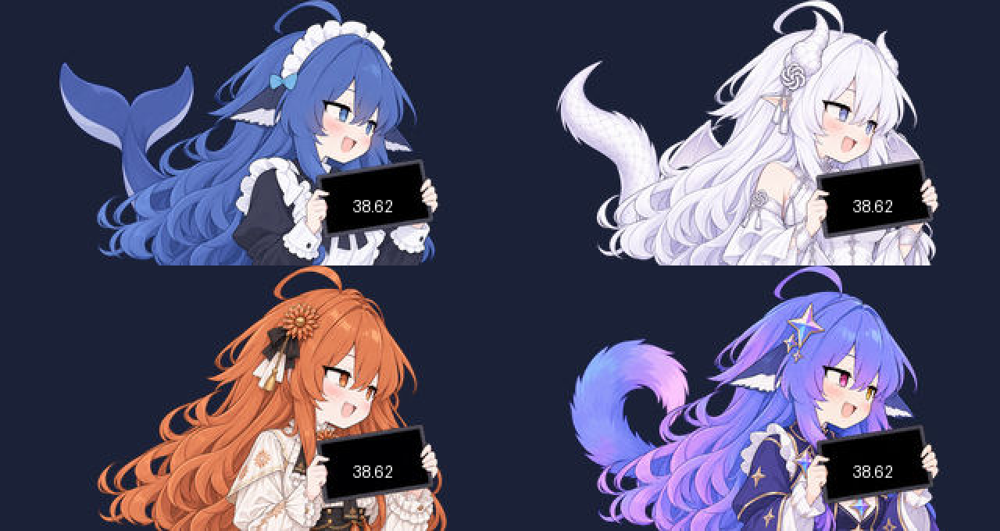

# LILYGO T-Display-S3 独立小屏版

面向**标准版、无触摸** LILYGO T-Display-S3（ESP32-S3、320×170 ST7789）的独立余额桌宠原型。上电后连接 Wi-Fi，直接通过 HTTPS 查询余额；Mac 不必持续运行。四个角色共用同一屏幕布局，**只在手持平板内显示金额数字**，不显示币种、状态栏或操作文字。蓝色大肥鱼在未连接时显示抱盆图。两枚实体键分别切换角色和立即刷新。



上图由压缩后的屏幕素材和示例数字合成，供检查位置；不是开发板实拍或真实账号余额。

## 构建与刷入

安装 [PlatformIO Core](https://docs.platformio.org/en/latest/core/installation/index.html)，在本目录执行：

```sh
pio run
pio device list
pio run -t upload --upload-port /dev/cu.usbmodemXXXX
pio device monitor -p /dev/cu.usbmodemXXXX -b 115200
```

请将端口替换为 `pio device list` 实际显示的开发板端口。只有确定端口属于 T-Display-S3 后再刷入；`/dev/cu.debug-console`、蓝牙和其他设备端口均不应猜测使用。本次已在检测到的 ESP32-S3（16 MB 闪存）上刷入，串口 `status` 命令有响应；屏幕、B1 切换和示例金额已在实机确认，联网取真实余额仍待验证。

若刷入失败或看不到串口，请按 [LILYGO 官方步骤](https://github.com/Xinyuan-LilyGO/T-Display-S3#9-faq)进入下载模式：连接 USB，按住 **BOOT**，短按 **RST**，先松开 RST，再松开 BOOT，然后重新检查端口。此操作可能覆盖板上原固件；如要保留出厂程序，先备份闪存。

## 首次设置

USB 串口监视器中输入以下命令，一行一个。命令中的密钥仅在本地输入，**不要发送到聊天、提交到 Git 或放进固件源码**。

```text
wifi 你的SSID|你的WiFi密码
api 你的DeepSeek_API_Key
```

如使用 DSH 平台账号凭证，第二行改为：

```text
account https://凭证中的issuer|凭证中的token
```

其他命令：`help` 查看帮助；`status` 查看连接状态（不打印密钥）；`next` 切换角色；`refresh` 立即刷新；`interval 30` 设置 10～300 秒刷新间隔；`demo` 在平板显示示例数字 38.62（不联网、不保存、不扣费）；`colors` 显示色彩对照画面（上半屏直接绘制，下半屏 JPEG 解码）；`stop` 退出演示或对照画面；`clear` 清除设备上的 Wi-Fi 与凭证。设置保存在 ESP32 的 NVS 闪存，重启后仍可独立运行。它不是加密保险箱：持有并能读取设备闪存的人可能取得凭证。使用独立、可撤销的凭证更合适。


色彩对照从左到右为红、绿、蓝、白、黑。若上、下两排不同，重点检查 JPEG 解码与 RGB565 字节顺序；若两排相同但都与标称颜色不符，重点检查屏幕驱动的颜色顺序或反相设置。预览图是源文件示意，不是实机照片。

实机对照中两排原色均正确，因此使用 [LILYGO 的 ST7789 `INIT_SEQUENCE_3`](https://github.com/Xinyuan-LilyGO/T-Display-S3/blob/main/lib/TFT_eSPI/User_Setups/Setup206_LilyGo_T_Display_S3.h) 初始化面板的电压、帧率和伽马参数，以修正角色图的中间色调。重新刷入后的角色画面颜色已由用户在实机确认正常；色彩对照命令保留供复查。

**B1 / BOOT（GPIO0）** 键切换角色，**B2（GPIO14）** 键立即刷新。长金额在平板内逐段滚动；断网或请求失败时不显示旧金额。错误原因可通过 USB 串口的 `status` 和请求日志查看。屏幕没有触摸功能。

## 功能与边界

- 支持 DeepSeek API Key 的 `/user/balance`，以及 DSH 平台账号凭证的 `/api/v0/users/get_user_summary`；只汇总 CNY 钱包，保留分位金额。
- 默认每 30 秒请求一次；每次请求完成后重新计时。HTTP 429 遵守数值型 `Retry-After`，否则退避；不会把认证头随重定向发送。HTTPS 使用随固件打包的根证书集合，并在联网校时后验证服务器证书。
- 余额每下降 0.01 元，数字每 0.2 秒递减并短暂变红；变化超过 4 元时直接对齐，充值立即对齐。没有真实扣费操作。
- 标准 T-Display-S3 没有扬声器，默认固件无音效。可接外置有源蜂鸣器，并在 `platformio.ini` 的 `build_flags` 增加 `-DDSH_BUZZER_PIN=可用GPIO`，启用简单提示音；这不是原版 MP3。
- 账号令牌过期后需要经串口重新设置；固件不负责 DSH 登录流程。该版本没有桌面悬浮窗、鼠标操作或 macOS 菜单栏。

## 图片与证书来源

`data/` 中五张角色 JPEG 是由仓库内 macOS 原始 PNG 缩至 **320×170 输出画布**、角色画面宽约 255 像素后生成，另为实机小屏轻微提亮暗部；第六张 JPEG 是色彩对照图。原 PNG 未被修改。运行 `uv run --with pillow python tools/make_assets.py` 可重建 JPEG 与模拟预览。

`data/x509_crt_bundle.bin` 使用 Espressif ESP-IDF v4.4 的 `gen_crt_bundle.py`，从 certifi 2026.7.22 的根证书集生成；它是公开的 CA 信息，不含账户密钥。证书集将来可能需要更新。构建依赖固定在 `platformio.ini`。刷写前保存的原机启动区与 SPIFFS 资料区备份放在本地 `factory-backups/`，该目录不纳入 Git；备份可能含设备原有数据，不要公开上传。
